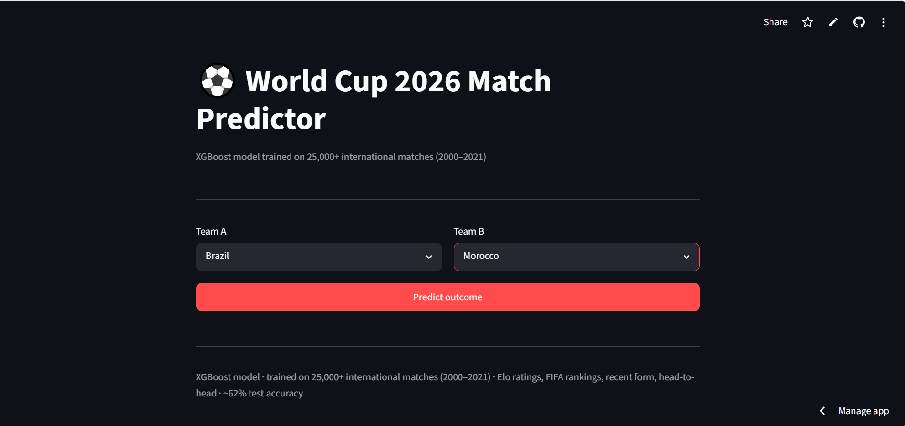
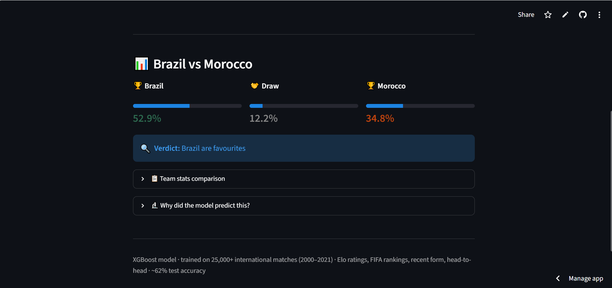
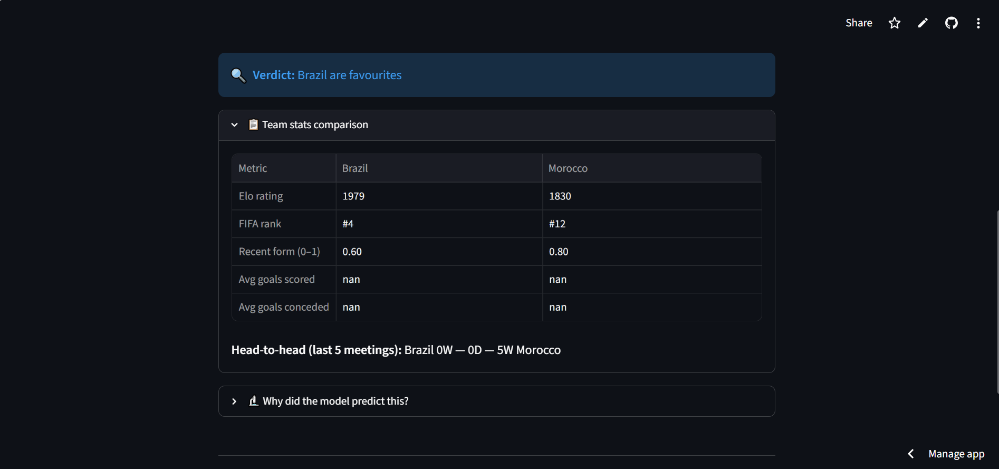
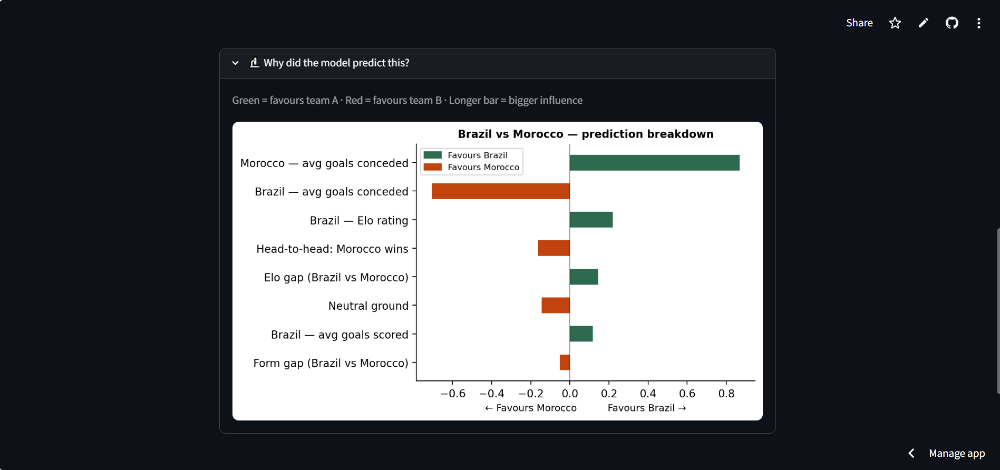

# ⚽ World Cup 2026 Match Predictor

> Predict the outcome of any World Cup 2026 match using machine learning — with explainable AI showing *why* the model made each prediction.

🔗 **[Live Demo → world-cup-2026-predictor.streamlit.app](https://world-cup-2026-predictor-m4wrw53nhaeubjwaina2u7.streamlit.app/)**

---

## 📸 Preview

| | |
|---|---|
|  |  |
|  |  |

---

## 🧠 What it does

Select any two of the 48 World Cup 2026 teams and get:
- **Win / Draw / Loss probabilities** powered by XGBoost
- **Team stats comparison** — Elo rating, FIFA rank, recent form, goals, head-to-head
- **SHAP explainability chart** — see exactly which factors drove the prediction

---

## 🛠️ How it works

### Data
| Dataset | Source |
|---|---|
| International match results (1872–2024) | Kaggle — martj42 |
| FIFA rankings (1992–2024) | Kaggle — cashncarry |
| Elo ratings (1872–2024) | Kaggle — saifalnimri |

### Features engineered
- **Elo rating difference** — most predictive single feature
- **FIFA ranking gap** — official team strength signal
- **Rolling form** — points from last 5 matches (normalised 0–1)
- **Average goals scored / conceded** — attacking and defensive form
- **Head-to-head record** — last 5 meetings between the two teams

### Models trained
| Model | CV Accuracy | Notes |
|---|---|---|
| Logistic Regression | ~55% | Baseline |
| Random Forest | ~60% | Handles non-linear interactions |
| **XGBoost** | **~62%** | Best performer — used in app |

> Football is inherently unpredictable. A 3-class accuracy of 62% significantly outperforms the random baseline of ~40%.

### Explainability
SHAP (SHapley Additive exPlanations) values show the contribution of each feature to every individual prediction — not just global importance.

---

## 🚀 Run locally

```bash
# Clone the repo
git clone https://github.com/sanyu200/world-cup-2026-predictor.git
cd world-cup-2026-predictor

# Install dependencies
pip install -r requirements.txt

# Run the app
streamlit run app.py
```

---

## 📁 Project structure

```
world-cup-2026-predictor/
│
├── app.py                      # Streamlit app
├── download_data.py            # Data download & preprocessing
├── feature_engineering.py      # Feature construction
├── model_training.py           # Model training & evaluation
├── evaluation.py               # SHAP plots & metrics
├── requirements.txt
│
├── data/
│   ├── raw/                    # Downloaded from Kaggle
│   └── processed/              # Cleaned feature matrix
│
└── models/
    ├── xgboost.pkl
    ├── random_forest.pkl
    ├── logistic_regression.pkl
    └── scaler.pkl
```

---

## 📊 Results

- **Test set accuracy:** ~62% (on matches from 2022 onwards)
- **Baseline:** ~40% (always predicting the most common class)
- **Top predictive features:** Elo rating gap, recent form, goals conceded average

---

## 🔧 Tech stack

`Python` · `XGBoost` · `scikit-learn` · `pandas` · `SHAP` · `Streamlit` · `matplotlib`

---

## 👤 Author

**Sana Bouhanda**  
[GitHub](https://github.com/sanyu200) · [LinkedIn](https://linkedin.com/in/your-profile)

---

*Built as a portfolio project during World Cup 2026 — June 2026*
